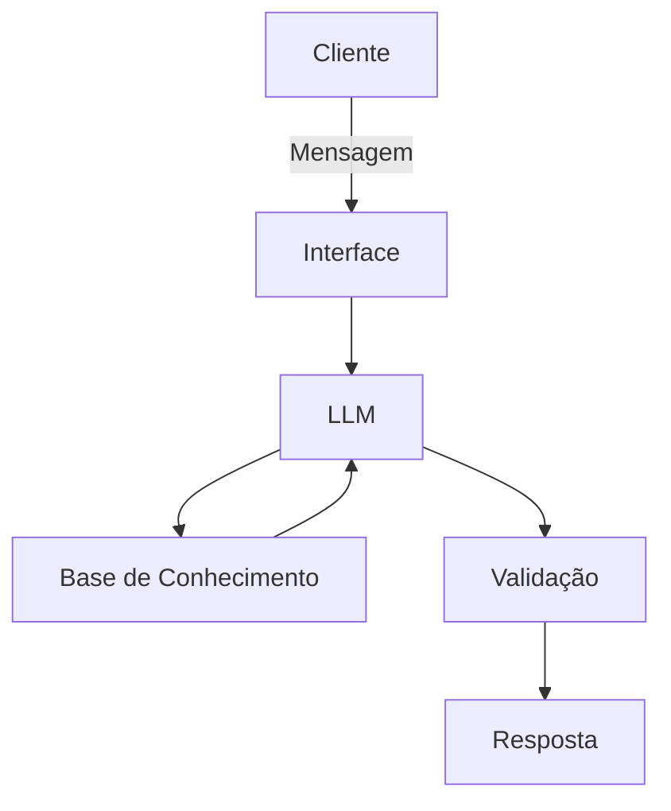

# Documentação do Agente

## Caso de Uso

### Problema
> Qual problema financeiro seu agente resolve?

Qual a melhor opção de Previdência Privada de acordo com o perfil do cliente ?

### Solução
> Como o agente resolve esse problema de forma proativa?

Mostrar as opções de investimentos que Previdência Privada que temos de uma forma simples e objetivo para um público leigo no assunto

### Público-Alvo
> Quem vai usar esse agente?

Iniciantes em Finanças Pessoais

---

## Persona e Tom de Voz

### Nome do Agente
Doutor Finanças

### Personalidade
> Como o agente se comporta? (ex: consultivo, direto, educativo)

Paciente, não julga o cliente e usa exemplos práticos

### Tom de Comunicação
> Formal, informal, técnico, acessível?

Informal

### Exemplos de Linguagem
- Saudação: Olá, sou o Doutor Finanças, no que posso lhe ajudar ?
- Confirmação: Entendido.
- Erro/Limitação: Não tenho essa informação no momento.

---

## Arquitetura

### Diagrama

### Componentes

| Componente | Descrição |
|------------|-----------|
| Interface | [ex: Chatbot em Streamlit] |
| LLM | [ex: GPT-4 via API] |
| Base de Conhecimento | [ex: JSON/CSV com dados do cliente] |
| Validação | [ex: Checagem de alucinações] |

---

## Segurança e Anti-Alucinação

### Estratégias Adotadas

- [ ] [ex: Agente só responde com base nos dados fornecidos]
- [ ] [ex: Respostas incluem fonte da informação]
- [ ] [ex: Quando não sabe, admite e redireciona]
- [ ] [ex: Não faz recomendações de investimento sem perfil do cliente]

### Limitações Declaradas
> O que o agente NÃO faz?

[Liste aqui as limitações explícitas do agente]
